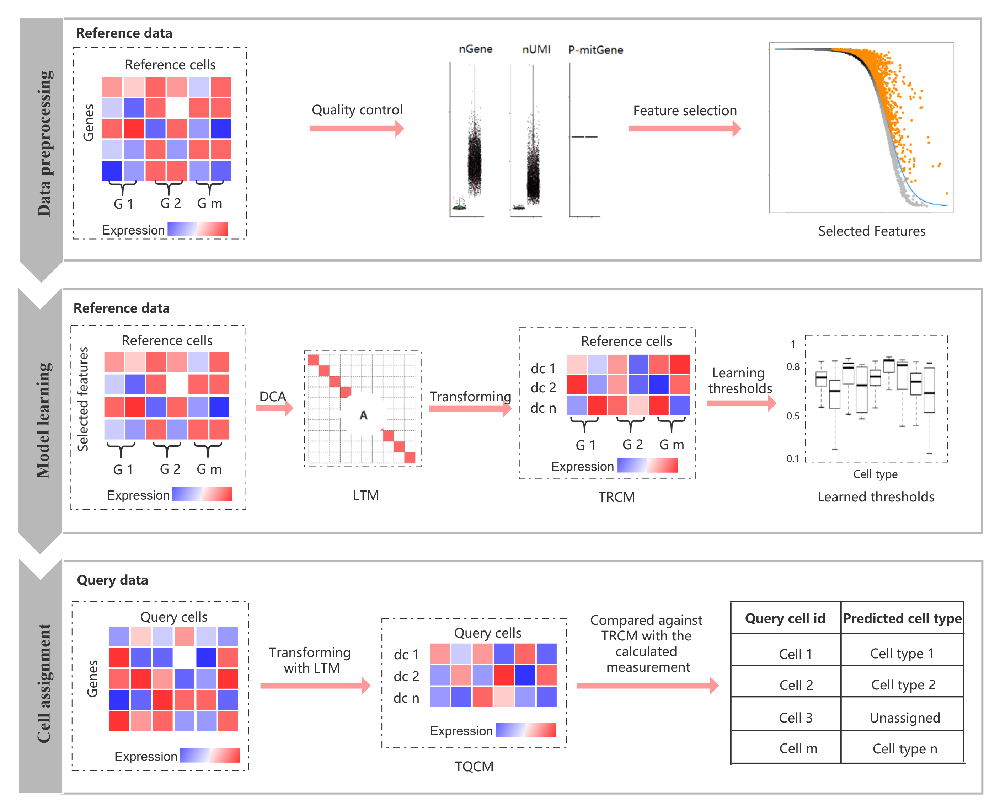

# **scLearn: Learning for single cell assignment**

* **scLearn** is a learning-based framework to automatically infer the quantitative measurement/similarity, rather than manually designed, which is naturally fit to different single cell assignment tasks to obtain a general well performance on different single cell types. We evaluated scLearn on 30 public available benchmark datasets and indicated that scLearn outperforms the existing methods for single cell assignment from various aspects, proven to be the state-of-the-art for single cell assignment with a reliable and generalized single cell type identification and categorizing ability.
* **scLearn** intuitively carrys out a search like scmap-cluster by measuring the similarity between query cells and each reference cluster centroid but with measurement and similarity thresholds learned from reference datasets. Basically, it consists of three steps: data preprocessing, model learning and cell assignment:
  * **Data preprocessing**: Besides the routine normalization and quality control for singlec cell RNA-sequencing data, scLearn removes rare cell types whose cell number are less than 10 from reference datasets. Then, scLearn performs feature selection with M3Drop which is based on dropout rate that has been proved suitable for single cell assignment.
  * **Model learning**: scLearn established a learning-based model to automatically learn the measurement used for cell assignment based on reference cell samples as the training data sources. In this model, scLearn first randomly selects a part of samples from each labeled classes with the sample similar or dissimilar information as the prior constrains. Then by applying the discriminative component analysis (DCA), a transformation matrix that leads to an optimal measurement that naturally fits the relationship between these samples is learned with the prior sample similar or dissimilar information. The bootstrapping sampling technology is utilized in this step to reduce sampling imbalances and obtain a stable learning-based model. In addition, one threshold for all datasets and all cell types is not suitable. To this end, in this step scLearn learns the similarity thresholds for each cell type in each dataset instead of specifying the prior thresholds.
  * **Cell assignment**: For the query data, cell quality control is optional to users. Then, the query data adopted features selected in the first step and obtained the transformed query cells with the learned transformation matrix. Then, the transformed query cells were assigned to the transformed reference cells. Finally, with learned thresholds in the second step, the cell type assignment results with rejection task were obtained.
  
* **The workflow of scLearn** 
<!-- -->
  **scLearn** consists of three steps: data preprocessing, model learning and cell assignment. (1) In the first step, the main processes consist of routine normalization, cell quality control, rare cell types filtering and feature selection; nGene, number of genes; nUMI, number of unique molecular identifier; P-mitGene, percentage of mitochondrial genes. G, cell group. (2) In the second step, DCA was applied to learn a transformation matrix. Then with the learned transformation matrix, the transformed reference cell samples were obtained for the following assignment. Also the similarity thresholds to label cell with “unassigned” for each cell type were also automatically learned. G, cell group; DCA, discriminative component analysis. LTM, learned transformation matrix; dc, discriminative component; TRCM, transformed reference cell matrix. (3) In the third step, the transformed query cell samples were obtained based on the learned transformation matrix, cell quality control is optional to users. The transformed query sample were compared against the transformed reference cell matrix to derive the measurement fulfilling the cell type assignment with rejection task. TQCM, transformed query cell matrix.

* For illustration purpose, we took the dataset **data_example/baron-human.rds** as an example.
    * **Install**: You can install the **scLearn** package from Github using **devtools** packages with **R>=3.6.1**.
    ```r
    library(devtools)
    install_github("bm2-lab/scLearn")
    ```
    * **Data preprocessing**:
    ```r
    # loading the reference dataset
    data<-readRDS('example_data/baron-human.rds')
    rawcounts=assays(data)[[1]]
    ann<-as.character(data$cell_type1)
    names(ann)<-colnames(data)
    # cell quality control and rare cell type filtered and feature selection
    data_qc<-Cell_qc(rawcounts,ann,species="Hs")
    data_type_filtered<-Cell_type_filter(data_qc$expression_profile,data_qc$sample_information,min_cell_number = 10)
    high_varGene_names <- Feature_selection_M3Drop(data_type_filtered$expression_profile)
    ```
    
    * **Model learning**:
    ```r
    # training the model
  scLearn_model_learning_result<-scLearn_model_learning(high_varGene_names,data_type_filtered$expression_profile,data_type_filtered$sample_information,bootstrap_times=10)
    ```
    
    * **Cell assignment**:
    ```r
    # loading the quary cell and performing cell quality control
    data2<-readRDS('example_data/xin-human.rds')
    rawcounts2=assays(data2)[[1]]
    ann2<-as.character(data2$cell_type1)
    names(ann2)<-colnames(data2)
    ann2<-ann2[ann2 %in% c("alpha","beta","delta","gamma")]
    rawcounts2<-rawcounts2[,names(ann2)]
    data_qc_query<-Cell_qc(rawcounts2,ann2,species="Hs")
    # Assignment with trained model above
    scLearn_predict_result<-scLearn_cell_assignment(scLearn_model_learning_result,data_qc_query$expression_profile)
    
    ```
* **Trained scLearn models** : For the convenience of users, besides the R package of scLearn, we also offered the whole trained models for the 30 datasets used in our study. These reference datasets comprehensively cover the commonly used brain cells, immune cells, pancreas cells, embryo stem cells, retina cells and lung cancer cell lines with coarse-grained and fine-grained annotation, which can be directly used and beneficial for the related single cell categorizing by experimental researchers. The information of each trained scLearn models is shown below:

  * | Trained model names | Description | No. of cell types | Corresponding dataset(Journal, date) |
    | :------: | :------: | :------: | :------: |
    | pancreas_mouse_baron.rds | Mouse pancreas | 9 | [Baron(Cell System, 2016)](https://www.ncbi.nlm.nih.gov/pubmed/27667365) |
    | pancreas_human_baron.rds | Human pancreas | 13 | [Baron(Cell System, 2016)](https://www.ncbi.nlm.nih.gov/pubmed/27667365) |
    | pancreas_human_muraro.rds | Human pancreas | 8 | [Muraro(Cell System, 2016)](https://www.ncbi.nlm.nih.gov/pubmed/27693023) |
    | pancreas_human_segerstolpe.rds | Human pancreas | 8 | [Segerstolpe(Cell Metabolism, 2016)](https://www.ncbi.nlm.nih.gov/pubmed/27667667) |
    | pancreas_human_xin.rds | Human pancreas | 4 | [Xin(Cell Metabolism, 2016)](https://www.ncbi.nlm.nih.gov/pubmed/27667665) |
    | embryo_development_mouse_deng.rds | Mouse embryo development | 4 | [Deng(Science, 2014)](https://www.ncbi.nlm.nih.gov/pubmed/24408435) |
    | cerebral_cortex_human_pollen.rds | Human cerebral cortex | 9 | [Pollen(Nature biotechnology, 2014)](https://www.ncbi.nlm.nih.gov/pubmed/25086649) |
    | colorectal_tumor_human_li.rds | Human colorectal tumors | 5 | [Li(Nature genetics, 2017)](https://www.ncbi.nlm.nih.gov/pubmed/28319088) |
    | brain_mouse_usoskin.rds | Mouse brain | 4 | [Usoskin(Nature neuroscience,2015)](https://www.ncbi.nlm.nih.gov/pubmed/25420068) |
    | cortex_mouse_tasic.rds | Mouse cortex | 17 | [Tasic(Nature neuroscience, 2016)](https://www.ncbi.nlm.nih.gov/pubmed/26727548) |
    | embryo_stem_cells_mouse_klein.rds | Mouse embryo stem cells | 4 | [Klein(Cell, 2015)](https://www.ncbi.nlm.nih.gov/pubmed/26000487) |
    | brain_mouse_zeisel.rds | Mouse brain | 9 | [Zeisel(Science, 2015)](https://www.ncbi.nlm.nih.gov/pubmed/25700174) |
    | retina_mouse_shekhar_coarse-grained_annotation.rds | Mouse retina | 4 | [Shekhar(Cell, 2016)](https://www.ncbi.nlm.nih.gov/pubmed/27565351) |
    | retina_mouse_shekhar_fine-grained_annotation.rds | Mouse retina | 17 | [Shekhar(Cell, 2016)](https://www.ncbi.nlm.nih.gov/pubmed/27565351) |
    | retina_mouse_macosko.rds | Mouse retina | 12 | [Macosko(Cell, 2015)](https://www.ncbi.nlm.nih.gov/pubmed/26000488) |
    | lung_cancer_cell_lines_human_cellbench10X.rds | Mixture of five human lung cancer cell lines | 5 | [CellBench10X(Nature methods, 2019)](https://www.ncbi.nlm.nih.gov/pubmed/31133762) |
    | lung_cancer_cell_lines_human_cellbenchCelSeq.rds | Mixture of five human lung cancer cell lines | 5 | [CellBenchCelSeq(Nature methods, 2019)](https://www.ncbi.nlm.nih.gov/pubmed/31133762) |
    | whole_mus_musculus_mouse_TM.rds | Whole Mus musculus | 55 | [TM(Nature, 2018)](https://www.ncbi.nlm.nih.gov/pubmed/30283141) |
    | primary_visual_cortex_mouse_AMB_coarse-grained_annotation_3.rds | Primary mouse visual cortex | 3 | [AMB(Nature, 2018)](https://www.ncbi.nlm.nih.gov/pubmed/30382198) |
    | primary_visual_cortex_mouse_AMB_fine-grained_annotation_14.rds | Primary mouse visual cortex | 14 | [AMB(Nature, 2018)](https://www.ncbi.nlm.nih.gov/pubmed/30382198) |
    | primary_visual_cortex_mouse_AMB_fine-grained_annotation_68.rds | Primary mouse visual cortex | 68 | [AMB(Nature, 2018)](https://www.ncbi.nlm.nih.gov/pubmed/30382198) |
    | PBMC_human_zheng_sorted.rds | FACS-sorted PBMC | 10 | [Zheng sorted(Nature communications ,2017)](https://www.ncbi.nlm.nih.gov/pubmed/28091601) |
    | PBMC_human_zheng_68K.rds | PBMC | 11 | [Zheng 68K(Nature communications, 2017)](https://www.ncbi.nlm.nih.gov/pubmed/28091601) |
    | primary_visual_cortex_mouse_VISP_coarse-grained_annotation.rds | Mouse primary visual cortex | 3 | [VISP(Nature, 2018)](https://www.ncbi.nlm.nih.gov/pubmed/30382198) |
    | primary_visual_cortex_mouse_VISP_fine-grained_annotation.rds | Mouse primary visual cortex | 33 | [VISP(Nature, 2018)](https://www.ncbi.nlm.nih.gov/pubmed/30382198) |
    | anterior_lateral_motor_area_mouse_ALM_coarse-grained_annotation.rds | Mouse anterior lateral motor area | 3 | [ALM(Nature, 2018)](https://www.ncbi.nlm.nih.gov/pubmed/30382198) |
    | anterior_lateral_motor_area_mouse_ALM_fine-grained_annotation.rds | Mouse anterior lateral motor area | 32 | [ALM(Nature, 2018)](https://www.ncbi.nlm.nih.gov/pubmed/30382198) |
    | middle_temporal_gyrus_human_MTG_coarse-grained_annotation.rds | Human middle temporal gyrus | 3 | [MTG(Nature, 2019)](https://www.ncbi.nlm.nih.gov/pubmed/31435019) |
    | middle_temporal_gyrus_human_MTG_fine-grained_annotation.rds | Human middle temporal gyrus | 34 | [MTG(Nature, 2019)](https://www.ncbi.nlm.nih.gov/pubmed/31435019) |
    | PBMC_human_a10Xv2.rds | Human PBMC | 9 | [PbmcBench pbmc1.10Xv2(bioRxiv, 2019)](https://doi.org/10.1101/632216) |
    | PBMC_human_a10Xv3.rds | Human PBMC | 8 | [PbmcBench pbmc1.10Xv3(bioRxiv, 2019)](https://doi.org/10.1101/632216) |
    | PBMC_human_CL.rds | Human PBMC | 7 | [PbmcBench pbmc1.CL(bioRxiv, 2019)](https://doi.org/10.1101/632216) |
    | PBMC_human_DR.rds | Human PBMC | 9 | [PbmcBench pbmc1.DR(bioRxiv, 2019)](https://doi.org/10.1101/632216) |
    | PBMC_human_iD.rds | Human PBMC | 7 | [PbmcBench pbmc1.iD(bioRxiv, 2019)](https://doi.org/10.1101/632216) |
    | PBMC_human_SM2.rds | Human PBMC | 6 | [PbmcBench pbmc1.SM2(bioRxiv, 2019)](https://doi.org/10.1101/632216) |
    | PBMC_human_SW.rds | Human PBMC | 7 | [PbmcBench pbmc1.SW(bioRxiv, 2019)](https://doi.org/10.1101/632216) |

  * **Cell Assignment with pre-trained models**:
    ```r
    # loading the quary cell and performing cell quality control
    data2<-readRDS('example_data/xin-human.rds')
    rawcounts2=assays(data2)[[1]]
    ann2<-as.character(data2$cell_type1)
    names(ann2)<-colnames(data2)
    ann2<-ann2[ann2 %in% c("alpha","beta","delta","gamma")]
    rawcounts2<-rawcounts2[,names(ann2)]
    data_qc_query<-Cell_qc(rawcounts2,ann2,species="Hs")
    
    # Assignment with pre-trained models
    # Take pancreas_human_baron.rds as example
    scLearn_model_learning_result<-readRDS("Trained_models/pancreas_human_baron.rds")
    ```
    ```r
    # Check the cell types in this reference
    length(scLearn_model_learning_result$cell_type_information)
    names(scLearn_model_learning_result$cell_type_information)
    ```
    ```
    ## 13
    ## 'acinar' 'activated_stellate' 'alpha' 'beta' 'delta' 'ductal' 'endothelial' 'epsilon' 'gamma' 'macrophage' 'mast' 'quiescent_stellate' 'schwann'
    ```
    ```
    # Predict the cell types
    scLearn_predict_result<-scLearn_cell_assignment(scLearn_model_learning_result,data_qc_query$expression_profile)
    
    ```
    
