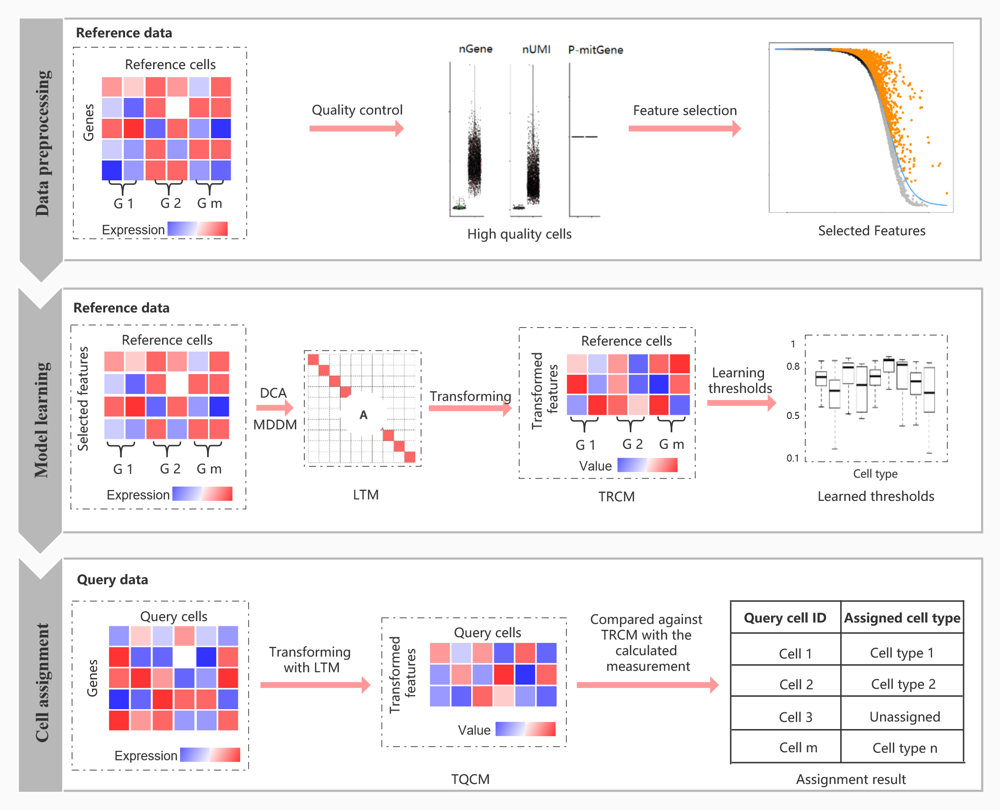

# **scLearn: Learning for single cell assignment**

## **Introduction**
* **scLearn** is a learning-based framework that automatically infers quantitative measurement/similarity and threshold that can be used for different single cell assignment tasks, achieving a well-generalized assignment performance on different single cell types. The main contributions of scLearn are (1) scLearn is robust to different assignment tasks with a well-generalized assignment performance, (2) scLearn is efficient in the identification of novel cell types that are absent in the reference datasets and (3) For the first time, a multi-label single cell assignment strategy is proposed in scLearn to assign single cell to proper time status as well as cell type simultaneously, proven to be effective for cell development and lineage analysis with additional temporal information. 
scLearn is developed as a R package, built in with comprehensive human and mammalian single cell reference datasets and pre-trained models, which can be utilized directly to facilitate broad applications of single cell assignment.
* **scLearn** a learning-based framework designed to intuitively carry out a cell search by measuring the similarity between query cells and each reference cell cluster centroid utilizing measurement and similarity thresholds learned from reference datasets, rather than manually designing the measurement/similarity or empirically selecting the threshold. Basically, scLearn comprises three main steps: data preprocessing, model learning, and cell assignment:
  * **Data preprocessing**: First, a routine normalization and quality control for single cell RNA-sequencing data is performed. scLearn removes the rare cell types whose cell numbers are less than 10 from the reference datasets. Then, scLearn performs feature selection utilizing M3Drop, which is based on a specific dropout rate that has proven suitable for single cell assignment.
  * **Model learning**: scLearn establishes a learning-based model to automatically learn the measurement used for cell assignment based on reference cells. In this model, the identification of query cell type is formulated as a single-label single cell assignment. The model learning comprise the following parts:
    * Discriminative component analysis (DCA) is applied and a transformation matrix that can be applied to formulate an optimal measurement that naturally fits the relationship between these samples is learned on the basis of the prior sample similarity or dissimilarity. 
    * In addition, the assignment of query cell into proper time point and cell type simultaneously is formulated as a multi-label single cell assignment. In this case, scLearn extended the DCA-based matrix transformation to a multi-label dimension reduction by maximizing the dependence between the original feature space and the associated labels (multi-label dimension reduction via dependence maximization, MDDM). 
    * For either case, the derived transformation matrix can be multiplied by the original reference data matrix and the query data matrix, respectively, and the learned measurement can be obtained on the basis of the distance/similarity between the transformed data samples. For single-label single cell assignment, bootstrapping sampling technology is also utilized in this step to reduce sampling imbalances and to obtain a stable learning-based model. 
    * It should be noted that single cell assignment methods must support the rejection task, while all existing single cell assignment strategies have adopted an empirical similarity threshold, such as a Pearson correlation coefficient of 0.7 or Cosine similarity of 0.5, which should differ among distinct datasets with different cell types and annotations. In general, the similarity thresholds of datasets with fine-grained annotation (deep annotation, i.e., cells are categorized in a fine-grained manner), should be larger than those of datasets with coarse-grained annotation (shallow annotation, i.e., cells are categorized in a coarse-grained manner), because the cells in the former datasets are more similar than the cells in the latter datasets. Therefore, one threshold for all datasets and all cell types is not suitable. To this end, in this step, scLearn learns the similarity thresholds for each cell type in each dataset instead of specifying a priori thresholds.
  * **Cell assignment**: Finally, according to the learned measurement and the learned threshold obtained with the learning-based model, scLearn assigns the cell type of the query cells by comparison with the reference datasets.
## **The scLearn workflow** 
<!-- -->
### **scLearn** comprises three steps: data preprocessing, model learning, and cell assignment. 
* **(1)** In the first step, the main processes comprise routine normalization, cell quality control, rare cell-type filtering, and feature selection; nGene, number of genes; nUMI, number of unique molecular identifiers; P-mitGene, percentage of mitochondrial genes; and G, cell group. 
* **(2)** In the second step, for single-label single cell assignment, DCA is applied to learn the transformation matrix; For multi-label single cell assignment, MDDM is applied to learn the transformation matrix. Then, with the learned transformation matrix, the transformed reference cell samples are obtained for the following assignment. Also, the thresholds for labeling a cell as “unassigned” for each cell type are also automatically learned. G, cell group; DCA, discriminative component analysis. LTM, Learned Transformation Matrix, which can be calculated by equation 3 for single-label single cell assignment or equation 9 for multi-label single cell assignment, respectively; and TRCM, Transformed Reference Cell Matrix, which can be calculated by equation 4. 
* **(3)** In the third step, the transformed query cell samples are obtained based on LTM with an available optional cell quality control procedure. The transformed query samples are compared against the transformed reference cell matrix to derive the measurement fulfilling the cell-type assignment with the rejection task. TQCM, Transformed Query Cell Matrix, which can be calculated by equation 5.

## **Install**
* **Install**: You can install the **scLearn** package from Github using **devtools** packages with **R>=3.6.1**.

    ```r
    library(devtools)
    install_github("bm2-lab/scLearn")
    ```
## **Tutorial**
### **Single-label single cell assignment**
* For illustration purpose, we took the dataset **data_example/baron-human.rds** as an example. 
    * **Data preprocessing**:
    ```r
    # loading the reference dataset
    data<-readRDS('example_data/baron-human.rds')
    rawcounts<-assays(data)[[1]]
    refe_ann<-as.character(data$cell_type1)
    names(refe_ann)<-colnames(data)
    # cell quality control and rare cell type filtered and feature selection
    data_qc<-Cell_qc(rawcounts,refe_ann,species="Hs")
    data_type_filtered<-Cell_type_filter(data_qc$expression_profile,data_qc$sample_information_cellType,min_cell_number = 10)
    high_varGene_names <- Feature_selection_M3Drop(data_type_filtered$expression_profile)
    ```
    
    * **Model learning**:
    ```r
    # training the model
  scLearn_model_learning_result<-scLearn_model_learning(high_varGene_names,data_type_filtered$expression_profile,data_type_filtered$sample_information_cellType,bootstrap_times=10)
    ```
    
    * **Cell assignment**:
    ```r
    # loading the quary cell and performing cell quality control
    data2<-readRDS('example_data/xin-human.rds')
    rawcounts2<-assays(data2)[[1]]
    query_ann<-as.character(data2$cell_type1)
    names(query_ann)<-colnames(data2)
    query_ann<-query_ann[query_ann %in% c("alpha","beta","delta","gamma")]
    rawcounts2<-rawcounts2[,names(query_ann)]
    data_qc_query<-Cell_qc(rawcounts2,query_ann,species="Hs")
    # Assignment with trained model above
    scLearn_predict_result<-scLearn_cell_assignment(scLearn_model_learning_result,data_qc_query$expression_profile)
    
    ```
### **Multi-label single cell assignment**
* For illustration purpose, we took the dataset **data_example/ESC.rds** as an example. 
    * **Data preprocessing**:
    ```r
    # loading the reference dataset
    data<-readRDS('example_data/ESC.rds')
    rawcounts<-assays(data)[[1]]
    refe_ann1<-as.character(data$cell_type1)
    names(refe_ann1)<-colnames(data)
    refe_ann2<-as.character(data$cell_type2)
    names(refe_ann2)<-colnames(data)
    # cell quality control and rare cell type filtered and feature selection
    data_qc<-Cell_qc(rawcounts,refe_ann1,refe_ann2,species="Hs")
    data_type_filtered<-Cell_type_filter(data_qc$expression_profile,data_qc$sample_information_cellType,data_qc$sample_information_timePoint,min_cell_number = 10)
    high_varGene_names <- Feature_selection_M3Drop(data_type_filtered$expression_profile)
    ```
    
    * **Model learning**:
    ```r
    # training the model
  scLearn_model_learning_result<-scLearn_model_learning(high_varGene_names,data_type_filtered$expression_profile,data_type_filtered$sample_information_cellType,data_type_filtered$sample_information_timePoint,dim_para=0.999)
    ```
    * **Cell assignment**: We just use 'example_data/ESC.rds' itself to test the multi-label single cell assignment here.
    ```r
    # loading the quary cell and performing cell quality control
    data2<-readRDS('example_data/ESC.rds')
    rawcounts2<-assays(data2)[[1]]
    query_ann1<-as.character(data2$cell_type1)
    names(query_ann1)<-colnames(data2)
    query_ann2<-as.character(data2$cell_type2)
    names(query_ann2)<-colnames(data2)
    rawcounts2<-rawcounts2[,names(query_ann1)]
    data_qc_query<-Cell_qc(rawcounts2,query_ann1,query_ann2,species="Hs")
    # Assignment with trained model above
    scLearn_predict_result<-scLearn_cell_assignment(scLearn_model_learning_result,data_qc_query$expression_profile)
### **Pre-trained scLearn models**
* **Pre-trained scLearn models** : For the convenience of users, besides the R package of scLearn, we also offered all the pre-trained models for the 30 datasets used in our study. These reference datasets comprehensively cover the commonly used brain cells, immune cells, pancreas cells, embryo stem cells, retina cells and lung cancer cell lines with coarse-grained and fine-grained annotation, which can be directly used and beneficial for the related single cell categorizing by experimental researchers. The information of each pre-trained scLearn models is shown below:

  * **The information of pre-trained scLearn models**
    | Pre-trained model names | Description | No. of cell types | Corresponding dataset(Journal, date) |
    | :------: | :------: | :------: | :------: |
    | pancreas_mouse_baron.rds | Mouse pancreas | 9 | [Baron(Cell System, 2016)](https://www.ncbi.nlm.nih.gov/pubmed/27667365) |
    | pancreas_human_baron.rds | Human pancreas | 13 | [Baron(Cell System, 2016)](https://www.ncbi.nlm.nih.gov/pubmed/27667365) |
    | pancreas_human_muraro.rds | Human pancreas | 8 | [Muraro(Cell System, 2016)](https://www.ncbi.nlm.nih.gov/pubmed/27693023) |
    | pancreas_human_segerstolpe.rds | Human pancreas | 8 | [Segerstolpe(Cell Metabolism, 2016)](https://www.ncbi.nlm.nih.gov/pubmed/27667667) |
    | pancreas_human_xin.rds | Human pancreas | 4 | [Xin(Cell Metabolism, 2016)](https://www.ncbi.nlm.nih.gov/pubmed/27667665) |
    | embryo_development_mouse_deng.rds | Mouse embryo development | 4 | [Deng(Science, 2014)](https://www.ncbi.nlm.nih.gov/pubmed/24408435) |
    | cerebral_cortex_human_pollen.rds | Human cerebral cortex | 9 | [Pollen(Nature biotechnology, 2014)](https://www.ncbi.nlm.nih.gov/pubmed/25086649) |
    | colorectal_tumor_human_li.rds | Human colorectal tumors | 5 | [Li(Nature genetics, 2017)](https://www.ncbi.nlm.nih.gov/pubmed/28319088) |
    | brain_mouse_usoskin.rds | Mouse brain | 4 | [Usoskin(Nature neuroscience,2015)](https://www.ncbi.nlm.nih.gov/pubmed/25420068) |
    | cortex_mouse_tasic.rds | Mouse cortex | 17 | [Tasic(Nature neuroscience, 2016)](https://www.ncbi.nlm.nih.gov/pubmed/26727548) |
    | embryo_stem_cells_mouse_klein.rds | Mouse embryo stem cells | 4 | [Klein(Cell, 2015)](https://www.ncbi.nlm.nih.gov/pubmed/26000487) |
    | brain_mouse_zeisel.rds | Mouse brain | 9 | [Zeisel(Science, 2015)](https://www.ncbi.nlm.nih.gov/pubmed/25700174) |
    | retina_mouse_shekhar_coarse-grained_annotation.rds | Mouse retina | 4 | [Shekhar(Cell, 2016)](https://www.ncbi.nlm.nih.gov/pubmed/27565351) |
    | retina_mouse_shekhar_fine-grained_annotation.rds | Mouse retina | 17 | [Shekhar(Cell, 2016)](https://www.ncbi.nlm.nih.gov/pubmed/27565351) |
    | retina_mouse_macosko.rds | Mouse retina | 12 | [Macosko(Cell, 2015)](https://www.ncbi.nlm.nih.gov/pubmed/26000488) |
    | lung_cancer_cell_lines_human_cellbench10X.rds | Mixture of five human lung cancer cell lines | 5 | [CellBench10X(Nature methods, 2019)](https://www.ncbi.nlm.nih.gov/pubmed/31133762) |
    | lung_cancer_cell_lines_human_cellbenchCelSeq.rds | Mixture of five human lung cancer cell lines | 5 | [CellBenchCelSeq(Nature methods, 2019)](https://www.ncbi.nlm.nih.gov/pubmed/31133762) |
    | whole_mus_musculus_mouse_TM.rds | Whole Mus musculus | 55 | [TM(Nature, 2018)](https://www.ncbi.nlm.nih.gov/pubmed/30283141) |
    | primary_visual_cortex_mouse_AMB_coarse-grained_annotation_3.rds | Primary mouse visual cortex | 3 | [AMB(Nature, 2018)](https://www.ncbi.nlm.nih.gov/pubmed/30382198) |
    | primary_visual_cortex_mouse_AMB_fine-grained_annotation_14.rds | Primary mouse visual cortex | 14 | [AMB(Nature, 2018)](https://www.ncbi.nlm.nih.gov/pubmed/30382198) |
    | primary_visual_cortex_mouse_AMB_fine-grained_annotation_68.rds | Primary mouse visual cortex | 68 | [AMB(Nature, 2018)](https://www.ncbi.nlm.nih.gov/pubmed/30382198) |
    | PBMC_human_zheng_sorted.rds | FACS-sorted PBMC | 10 | [Zheng sorted(Nature communications ,2017)](https://www.ncbi.nlm.nih.gov/pubmed/28091601) |
    | PBMC_human_zheng_68K.rds | PBMC | 11 | [Zheng 68K(Nature communications, 2017)](https://www.ncbi.nlm.nih.gov/pubmed/28091601) |
    | primary_visual_cortex_mouse_VISP_coarse-grained_annotation.rds | Mouse primary visual cortex | 3 | [VISP(Nature, 2018)](https://www.ncbi.nlm.nih.gov/pubmed/30382198) |
    | primary_visual_cortex_mouse_VISP_fine-grained_annotation.rds | Mouse primary visual cortex | 33 | [VISP(Nature, 2018)](https://www.ncbi.nlm.nih.gov/pubmed/30382198) |
    | anterior_lateral_motor_area_mouse_ALM_coarse-grained_annotation.rds | Mouse anterior lateral motor area | 3 | [ALM(Nature, 2018)](https://www.ncbi.nlm.nih.gov/pubmed/30382198) |
    | anterior_lateral_motor_area_mouse_ALM_fine-grained_annotation.rds | Mouse anterior lateral motor area | 32 | [ALM(Nature, 2018)](https://www.ncbi.nlm.nih.gov/pubmed/30382198) |
    | middle_temporal_gyrus_human_MTG_coarse-grained_annotation.rds | Human middle temporal gyrus | 3 | [MTG(Nature, 2019)](https://www.ncbi.nlm.nih.gov/pubmed/31435019) |
    | middle_temporal_gyrus_human_MTG_fine-grained_annotation.rds | Human middle temporal gyrus | 34 | [MTG(Nature, 2019)](https://www.ncbi.nlm.nih.gov/pubmed/31435019) |
    | PBMC_human_a10Xv2.rds | Human PBMC | 9 | [PbmcBench pbmc1.10Xv2(bioRxiv, 2019)](https://doi.org/10.1101/632216) |
    | PBMC_human_a10Xv3.rds | Human PBMC | 8 | [PbmcBench pbmc1.10Xv3(bioRxiv, 2019)](https://doi.org/10.1101/632216) |
    | PBMC_human_CL.rds | Human PBMC | 7 | [PbmcBench pbmc1.CL(bioRxiv, 2019)](https://doi.org/10.1101/632216) |
    | PBMC_human_DR.rds | Human PBMC | 9 | [PbmcBench pbmc1.DR(bioRxiv, 2019)](https://doi.org/10.1101/632216) |
    | PBMC_human_iD.rds | Human PBMC | 7 | [PbmcBench pbmc1.iD(bioRxiv, 2019)](https://doi.org/10.1101/632216) |
    | PBMC_human_SM2.rds | Human PBMC | 6 | [PbmcBench pbmc1.SM2(bioRxiv, 2019)](https://doi.org/10.1101/632216) |
    | PBMC_human_SW.rds | Human PBMC | 7 | [PbmcBench pbmc1.SW(bioRxiv, 2019)](https://doi.org/10.1101/632216) |
    
  * **The pre-trained models for [20 mouse organs](https://www.ncbi.nlm.nih.gov/pmc/articles/PMC6642641/)**
  
    | Trained model names | Description | No. of cell types |
    | :------: | :------: | :------: |
    | Aorta_mouse_FACS.rds | Mouse aorta | 4 |
    | Bladder_mouse_FACS.rds | Mouse bladder | 2 |
    | Brain_Myeloid_mouse_FACS.rds | Mouse brain myeloid | 2 |
    | Brain_Non-Myeloid_mouse_FACS.rds | Mouse brain non-myeloid | 7 |
    | Diaphragm_mouse_FACS.rds | Mouse diaphragm | 5 |
    | Fat_mouse_FACS.rds | Mouse fat | 6 |
    | Heart_mouse_FACS.rds | Mouse heart | 10 |
    | Kidney_mouse_FACS.rds | Mouse kidney | 5 |
    | Large_Intestine_mouse_FACS.rds | Mouse large intestine | 5 |
    | Limb_Muscle_mouse_FACS.rds | Mouse limb muscle | 8 |
    | Liver_mouse_FACS.rds | Mouse liver | 5 |
    | Lung_mouse_FACS.rds | Mouse lung | 11 |
    | Mammary_Gland_mouse_FACS.rds | Mouse mammary gland | 4 |
    | Marrow_mouse_FACS.rds | Mouse marrow | 21 |
    | Pancreas_mouse_FACS.rds | Mouse pancreas | 9 |
    | Skin_mouse_FACS.rds | Mouse skin | 5 |
    | Spleen_mouse_FACS.rds | Mouse spleen | 3 |
    | Thymus_mouse_FACS.rds | Mouse thymus | 3 |
    | Tongue_mouse_FACS.rds | Mouse tongue | 2 |
    | Trachea_mouse_FACS.rds | Mouse trachea | 4 |
  

  * **Cell assignment with pre-trained models**:
    ```r
    # loading the quary cell and performing cell quality control
    data2<-readRDS('example_data/xin-human.rds')
    rawcounts2<-assays(data2)[[1]]
    query_ann<-as.character(data2$cell_type1)
    names(query_ann)<-colnames(data2)
    query_ann<-query_ann[query_ann %in% c("alpha","beta","delta","gamma")]
    rawcounts2<-rawcounts2[,names(query_ann)]
    data_qc_query<-Cell_qc(rawcounts2,query_ann,species="Hs")
    
    # Assignment with pre-trained models
    # Take pancreas_human_baron.rds as example
    scLearn_model_learning_result<-readRDS("Trained_models/pancreas_human_baron.rds")
    ```
    ```r
    # Check the cell types in this reference
    length(scLearn_model_learning_result$cell_type_information)
    names(scLearn_model_learning_result$cell_type_information)
    ```
    ```
    ## 13
    ## 'acinar' 'activated_stellate' 'alpha' 'beta' 'delta' 'ductal' 'endothelial' 'epsilon' 'gamma' 'macrophage' 'mast' 'quiescent_stellate' 'schwann'
    ```
    ```
    # Predict the cell types
    scLearn_predict_result<-scLearn_cell_assignment(scLearn_model_learning_result,data_qc_query$expression_profile)
    
    ```
    
